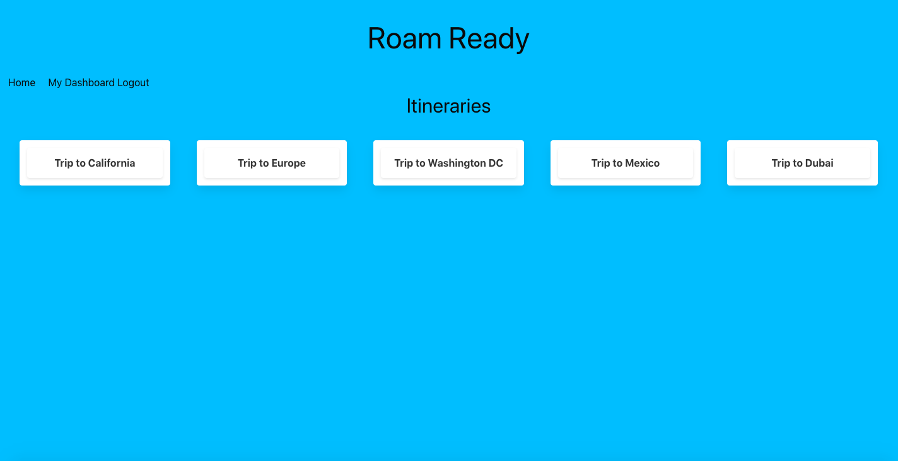

# Roam-Ready

## Description
   The roam ready application is a travel social site and was created for all users. With this blog site the user is prompted to the homepage with different itineraries. When the user tries to click on one of the itineraries they are taken to a login page that requires the user to login with their credentials or to sign up if they do not have an account yet. Once the user is logged in the user is taken straight to the dashboard and is able to see all their itineraries that they created. They are also able to create a new itinerary which will save on their dashboard with the title of their itinerary. The user is able to click on the itinerary and they will see the description and comments that are associated with that itinerary. The itinerary is also saved and added to the homepage of the application. When the user navigates to the homepage application, they are able to see all the itineraries of all the users along with their comments.When the user clicks on a different itinerary. Then they are able to read the description, comments, and are able to add comments on that itinerary. Once the user is done and has completed everything in their session, they are able to logout by simply clicking the logout link in their navbar.   

## Installation
 
 For this application to work bcrypt, connect-session-squelize, express.js, express-handelbars, express-session, MySQL, and squelize needs to be installed 

## Usage

This application is a wonderful social site. It allows users to interact with eachother and lookup different itineraries to inspire their next adventure. This is also a great place to store and keep their itineraries organized. This application is user friendly and perfect for anyone! 

https://github.com/FiggersRM/Roam-Ready
https://limitless-badlands-70129.herokuapp.com/

## Credits

Mitch Figgers: https://github.com/FiggersRM

Vita Fomin: https://github.com/vitafomin 

Massar Sow

Morgan Howard

Brandon Hutchinson 

## License

Please refer to the LICENSE in the repo
